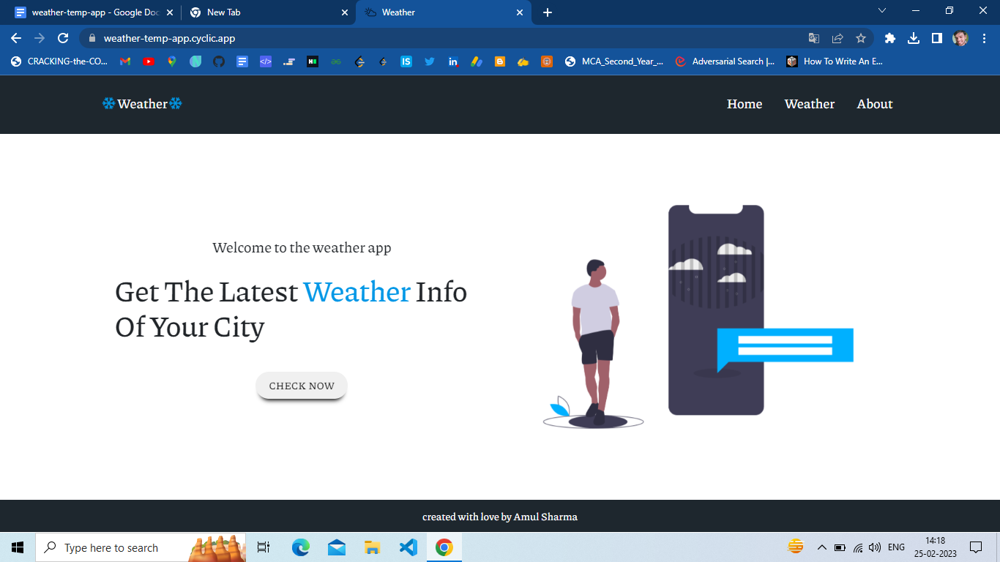
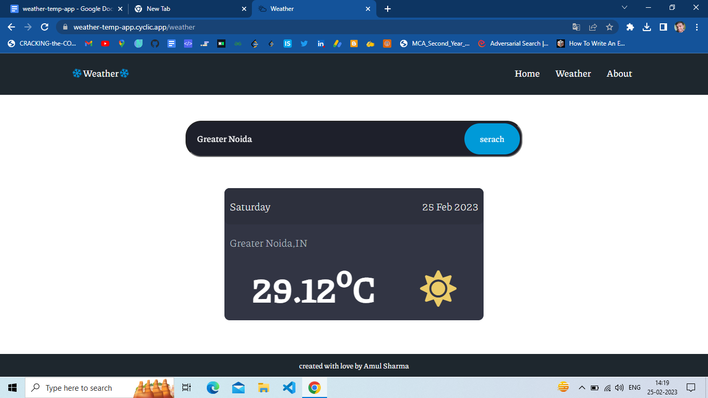
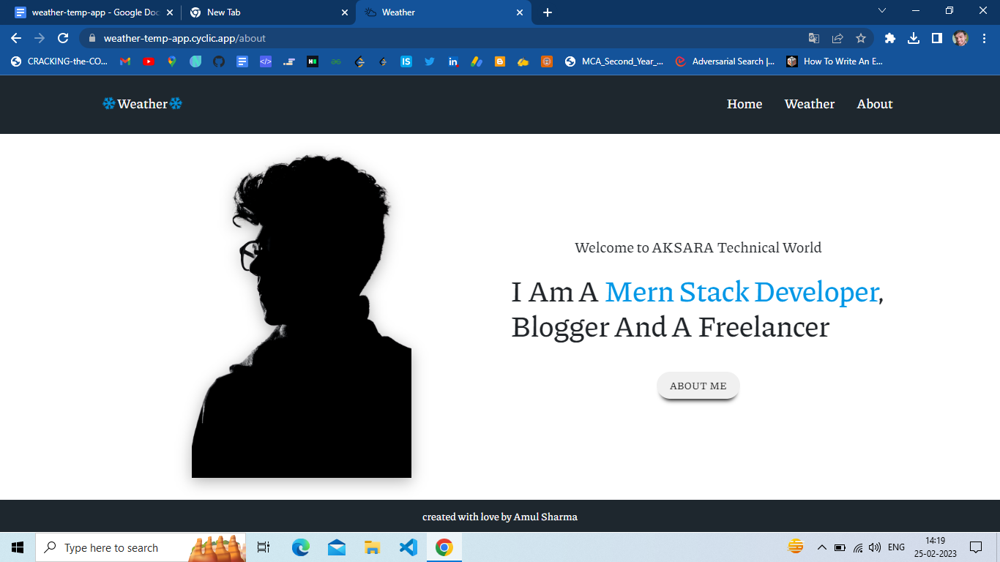

# Weatherapp
A weather app that pulls from the OpenWeatherMap API to allow users to search for and view the weather in cities worldwide. Built with nodejs and Express.

Let's talk about the application; Our weather app will show the weather information that it will get from the API like this, an Icon that shows the weather status, the temperature value (18°C) in Celsius unit, the weather description (clear sky/ICON), and then the user's city and country (London, GB).

The API provider is [http://www.OpenWeatherMap.org](http://www.OpenWeatherMap.org)

## Landing Page

## Weather

## About
*Click On the Aboutme Button To know more About Me*

Additional description about the project and its features.
## Built With
 - HTML
 - CSS
 - JAVASCRIPT
 - NPM
 - HANDLEBARS
 - BOOTSTRAP
 - EXPRESS
 - NODEJS
 - OpenWeatherMap API
 
 ## Live Demo
[Live Demo Link 👈](https://weather-temp-app.cyclic.app)

## Getting Started
- Follow the live demo link and enjoy the site.
### Usage
- To get a local copy up and running follow these simple example steps.
Clone the repository unto your local machine cd to the folder.

### Prerequisites
- A modern browser, up to date. 💪

 ### Run tests
- There is no automated tests for this project.

### Future features
- Add extra functionality and Forcast.

## Author
 ### 👤 Amul Sharma
 - Email: sharmaamul64@gmail.com
 - Twitter: [@Twitter](https://twitter.com/Amul_Sharma64)
 - Linkdin: [@Linkdin](https://www.linkedin.com/in/amul-sharma2000)
 
## Show your support
Give a ⭐️ if you like this project!

## 📝 License
This project is  licensed.
